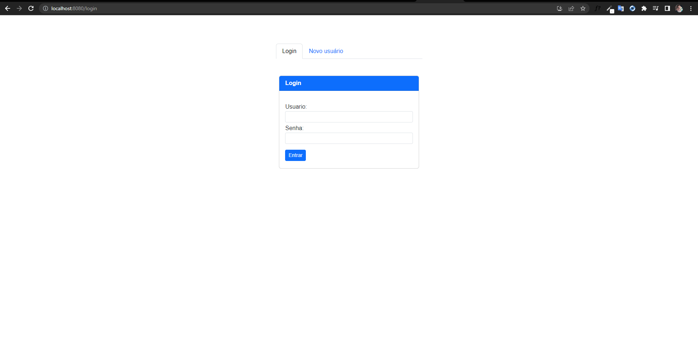
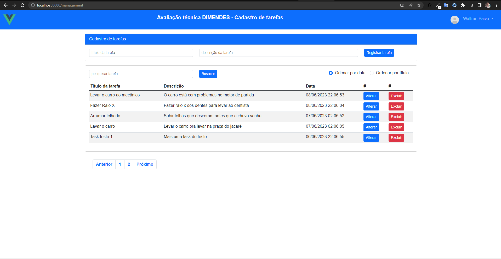

<p align="center">
  
</p>

# Front-end Vue - front-end para gerenciamento de tarefas (Avaliação técnica DIMENDES)

<p align="center">
  
</p>
<br>
<p align="center">
  
</p>


## O que é este projeto?
O projeto tem como objetivo o gerenciamento de tarefas. Exibir uma lista de tarefas, adicionar uma nova tarefa, editar uma tarefa existente e excluir uma tarefa. Contemplando também paginação de tarefas, filtros de pesquisa e ordenação. Tudo a nível de autenticação de usuário.

## Pré-requisitos
- Node.js
- npm
- Vue CLI
- Requer o backend-end feito em laravel que provê as api's que este front-end irá se comunicar. Link: https://github.com/walfranp/avaliacao-dimendes-api 

## Para rodar este projeto
```bash
$ npm install
$ npm run serve #lembre-se de startar o backend para a aplicação se comunicar com o banco
```
Acesssar pela url: http://localhost:8080

